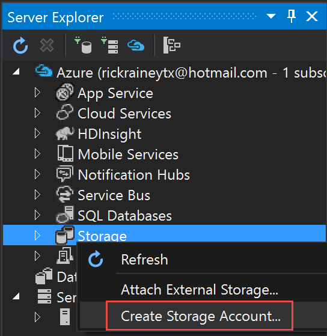
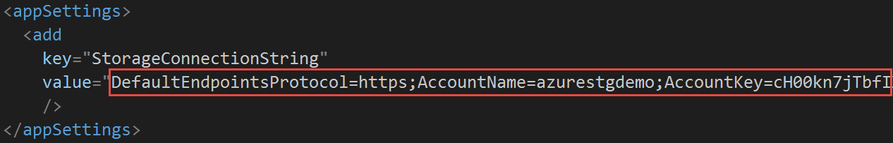
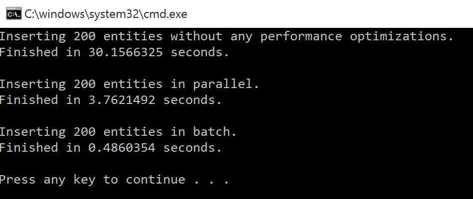
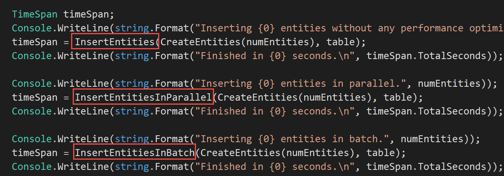
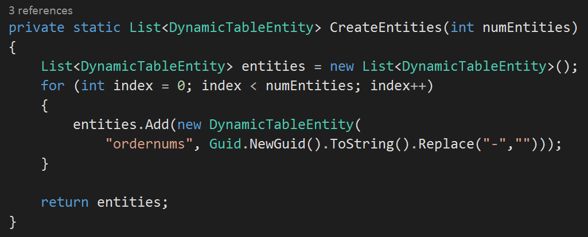
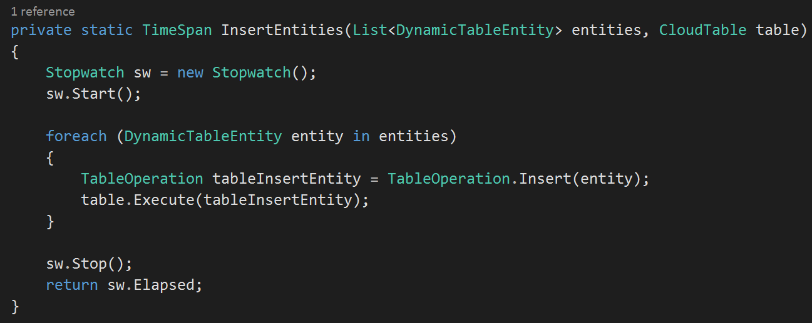
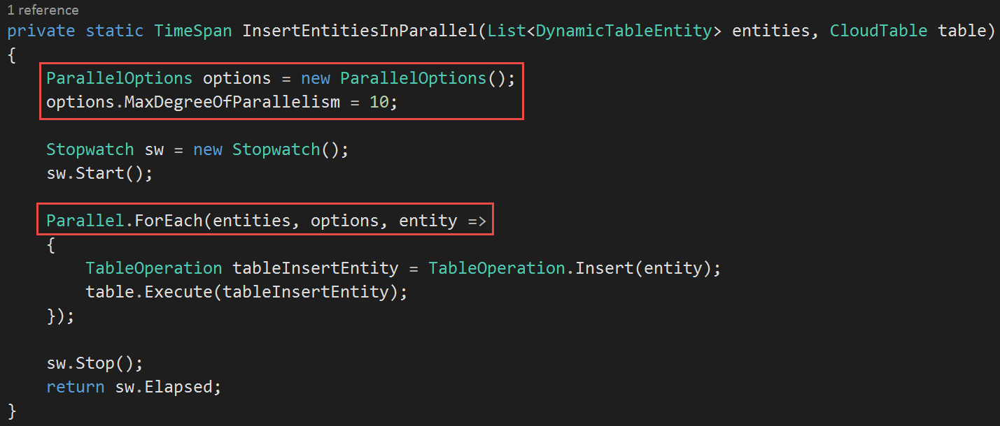
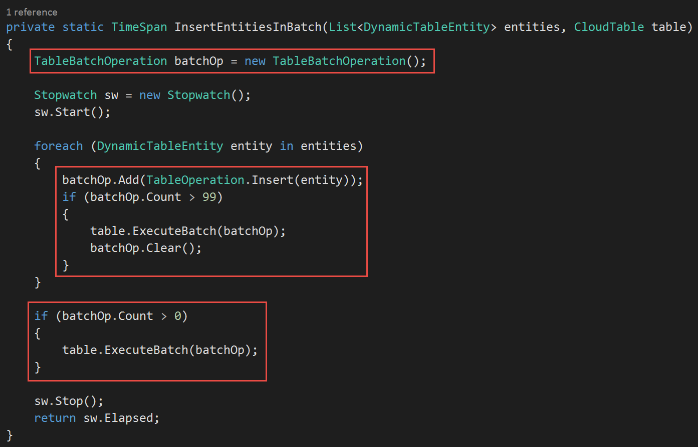

# Demo - Storage Table Insert

This guide demonstrates how a few simple code changes can significantly improve the performance of insert operations on Tables by minimizing effects of latency and serial operations. Note: For this demo we use Tables, but the concepts are applicable also to Queues.

#### Pre-Requisites
This section lists the pre-requisites required for this demonstration.
*	Azure subscription
•	Visual Studio 2015 (Visual Studio 2013 should workas well) with Azure SDK

#### Setup
Estimated time: 5 minutes

1.	Open Visual Studio.
2.	Using Visual Studio, open the solution at c:\azurecoe\demos\storage\TableStorage.Demo.Solution.sln.
3.	Select BUILD > Rebuild Solution.
4.	Open Server Explorer (Ctrl-W,L) and connect to your Azure subscription.
5.	Right-click on Storage and select Create Storage Account. 
  a.	Set Region to a region close to you. 
  b.	Set Replication to Locally Redundant. 
  c.	Click Create. 

  
  
6.	Open app.config.
7.	Set the StorageConnectionString in <appSettings> to the connection string for your storage account.
8.	Save the changes 

9.	Press Ctrl-F5 to build and run the solution.   Your output should look similar as shown. 

 
#### Demo Steps
Estimated time: 7 minutes

1.	Press Ctrl-F5 to run the app.  While it is running explain the application – uses Azure Table Storage and is uploading 200 entities (GUIDs) three different ways.  Obviously the first number is not very impressive.  However, you can significantly improve performance with a few simple code changes.
Note: This demo also assumes the same partition key for all entities, hence the reason we can do batch processing.
2.	Open Program.cs and show the three calls to insert entities.  In this demo we will look at each. 
  
3.	First, show CreateEntities() just to show that we’re doing nothing more than generating a GUID to represent each entity.  The partition key for the table is hard-coded as ordernums and the row key will be set to the GUID.  
Be careful to point out the purpose is not to show how you should structure your partition keys and row keys.  Instead, it’s just a quick implementation so we can look at some ways to improve performance when working with tables. 
  
4.	Show the code for InsertEntities().  This is pretty straight forward – simply iterating through the list of entities and performing an insert operation for each entity in the list.  Unfortunately, as you saw when we ran this code, it was extremely slow.  But, this is a typical pattern that many developers will implement due to it’s simplicity. 
  
5.	Show the code for InsertEntitiesInParallel().  The only change to the code here is that we use the built-in Parallel task library to insert the entities in parallel.  It’s not a difficult change, but as you saw in the output before, it took only about 10% of the time to complete that the previous code took. 
  
6.	Show the code for InsertEntitiesInBatch().  Batching is a technique you can use when you have multiple entity operations on entities in the same partition.  To do this we use the TableBatchOperation class.  As we iterate through the list of entities, rather than inserting each separately, we add them to the batch.  A batch can be up to 100 entities so once we hit that limit we invoke a batch insert of those entities, clear the batch, and then continue.  Note, you can have different operations in the batch, such as update an entity, insert an entity, and delete an entity.  With this relatively simple code change, the entities are inserted in about 1% of the time it originally took without any modifications. 
  

#### Clean Up
To clean up this environment, delete the storage account you created.

